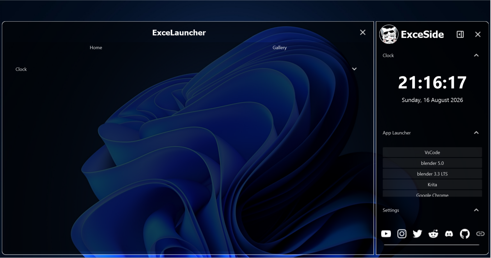

# Simple Desktop Widget

A Customizable desktop widget using PySide6! 

**“Fast Widgets Easy to Code”** i mean the widget from Qt which is from C++ and Easy to code using Python with PySide6 library

*(This project still WIP several widget and content still empty)*.

## License

This project is licensed under the MIT License.
See the [LICENSE](LICENSE) file for details.

## Previews



## Getting Started

Follow these steps to set up the project.

### Prerequisites

You need to install the following software:
- python 3.12
- and some libraries in ```requirements.txt```

### Installation

1. Clone the repository:
   ```bash
   git clone https://github.com/excelixInt/launcher-widget
   ```
2. Navigate to the project directory:
   ```bash
   cd launcher-widget
   ```
3. Install libraries (if not installed yet):
   ```bash
   pip install -r requirements.txt
   ```

## Usage

How to use this project

### Running the App

Start the program:
```bash
python main.py
```

## Customization

Create , Style , Configure and Attach your widget to the app!

### Create new widget and content
#### Sidebar
- **Use widgets folder** : ```widgets/```
- **Create new file** : for example ```GalleryWidget.py```
- **Code your new custom widget** : 
    
    *note: file and class name must matched.*
    ```python
    from core.widgets import *

    class GalleryWidget(BaseWidget):
        def __init__(self,title = "Gallery"):
            super().__init__(title)
    ```
- **Fill your widget body content** :
    ```python
    from core.widgets import *

    class GalleryWidget(BaseWidget):
        def __init__(self,title = "Gallery"):
            super().__init__(title)

        def fillBodyContent(self,body):
            bodyLayout = QVBoxLayout(body) # assign body layout

            # content
            widget = QLabel("This is my gallery widget") 
            pix
            image = QImage()

            # place
            bodyLayout.addWidget(widget)
            bodyLayout.addWidget(image)
    ```

#### PanelContainer
- **Use widgets folder** : ```contents/```
- **Create new file** : for example ```Home.py```
- **Code your new custom widget** : 
    
    *note: file and class name must matched.*
    ```python
    from core.widges import *

    class Home(BaseContent):
        def __init__(self,title = "Home"):
            super().__init__(title)
    ```
- **Fill your content with widgets or create manually in fillContent()** :
    ```python
    from core.widgets import *
    from widgets.ClockWidget import ClockWidget

    class Home(BaseContent):
        def __init__(self, title = "Home"):
            super().__init__(title)
    
        def fillContent(self, container):
            container.layout().addWidget(ClockWidget())
            container.layout().addStretch()
    ```

### Style
#### Setup
- Open ```styles/``` folder
- Create new folder for create new custom style : for example ```styles/violet/```
- Every style folder required file style :
    - ```leftmode.uis``` apply when **sidebar** in the leftmode,
    - ```rightmode.uis``` apply when **sidebar** in the rightmode,
    - ```widgets.css.uis``` for every custom widgets and contents

#### Styling
*note : Styling based on Qt Style Sheet (QSS) format not CSS*
- Available base selector :
    ```css
    /* Sidebar */
    #Sidebar #container
    #Sidebar #container #Head #ProfileImage {}
    #Sidebar #container #Head #Title {}
    #Sidebar #container #Body #content {}
    #Sidebar #container #Body #scrollarea {}
    #Sidebar #container #Body #scrollarea QScrollBar:vertical {}
    #Sidebar #container #Foot #content {}
    #Sidebar #container #Foot #scrollarea {}

    /* PanelContainer */
    #PanelContainer #container {}
    #PanelContainer #container #Head #title {}
    #PanelContainer #container #Body #content {}
    ```
    
- For example with ```leftmode.uis``` or ```rightmode.uis``` :
    ```css
    #Sidebar #container {
        background-color: rgba(127, 0, 255,200);
        border:1px solid rgb(127, 0, 255);

        border-top-left-radius:10px;
        border-top-right-radius:10px;
        border-bottom-left-radius:10px;
        border-bottom-right-radius:10px
    }
    ```

- For example with ```widgets.uis``` :
    ```css
    #ClockWidget #clockLabel {
        font-size : 45px;
        font-weight : bold;
        color : white;
    }
    ```

### Configure

- Every widgets and contents have builtin function for data management :
    ```python
    # it will load json from 'data/' folder if the json file not yet created it will make it
    self.loadData() 
    ```

- for example :
    ```python
    class Home(BaseContent):
        def __init__(self, title = "Home"):
            super().__init__(title)

        def fillContent(self, container):
            self.loadData() # load json data from: data/contents/Home.json
            print(self.data) # check the data

            container.layout().addWidget(ClockWidget())
            container.layout().addStretch()
    ```
- to configure the root app, use `settings.json` . for example:
    ```json
    {
        "appName":"ExceLauncher",
        "style":{
            "folderName":"default",
            "fileExtension":".uis"
        },
        "defaultSideMode":"rightmode",
        "animation":{
            "duration":200,
            "easing":"OutBack"
        },
        "hotkeyTrigger":{
            "keyMod":1,
            "key":79
        }
    }   
    ```
    - appName : your application name
    - style
        - folderName : the folder style for the app, `default` its from `style/default`
        - fileExtension : file style extension 
    - defaultSideMode : default sidebar side when app opened
    - animation
        - duration : the app animation duration when open and close
        - easing : the animation movement more cool and smooth, use the flag from  `QEasingCurve.Type`
    - hotkeyTrigger 
        - keyMod and key : trigger for the app open and close, it complicated, but the default is `{"keyMod" : 1, "key" : 79}` it mean you need click `Alt + O` for open and close the Sidebar and PanelContainer 

### Attach

- You need attach your widget to the app
- for widgets in the sidebar you can edit `data/Sidebar.json`
    ```json
    {
        "title":"ExceSide",
        "profileImage":"data/images/profile.png",
        "widgets":[
            "ClockWidget","AppLauncherWidget","SettingsWidget","MusicPlayerWidget"
            
        ],
        "connectionsData":"data/connections.json"
    }
    ```
    attach on `"widgets"` key and value must array with the name widgets class you have in `widgets/`

- for contents in the PanelContainer you can edit `data/PanelContainer.json`
    ```json
    {
        "title":"ExceLauncher",
        "contents":["Home","Gallery"]
    }
    ```
    attach on `"contents"` key and value must array with the name contents class you have in `contents/`

## Creator Note

uh idk

## Creator Information

[twitter](https://x.com/ExcelixStr) - [reddit](https://www.reddit.com/user/Excelix_) - [discord](https://discordapp.com/users/1033740687667122246) - [github](https://github.com/excelixInt) - [ExceGithubPage](https://excelixint.github.io)

Project Link: [ExceWidget](https://github.com/excelixInt/launcher-widget)
